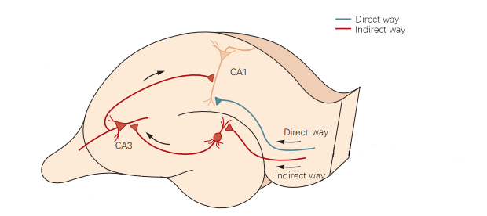
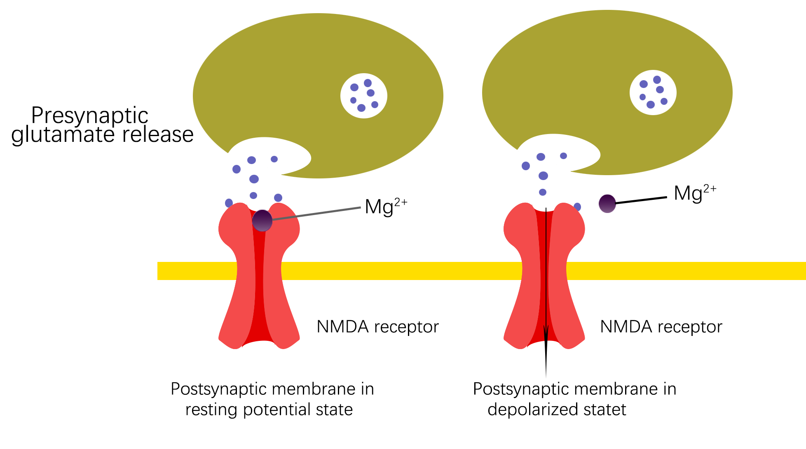
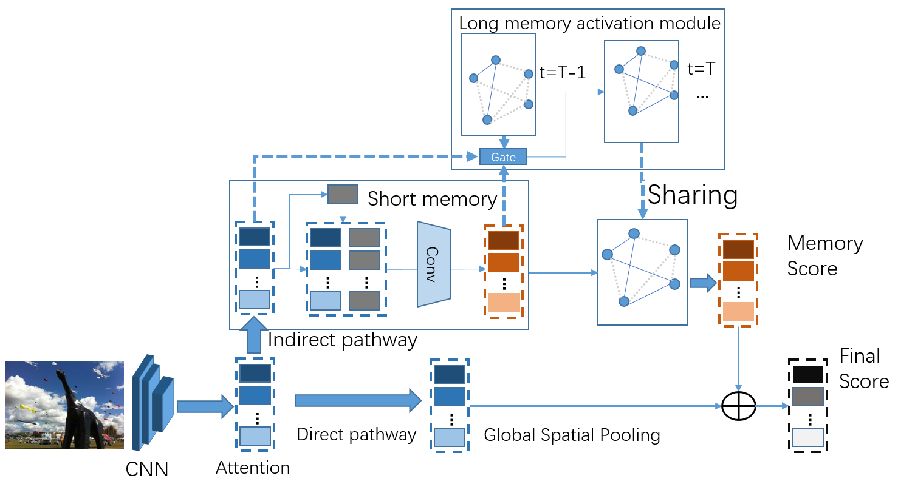

# M-GCN:Brain-inspired Memory Graph Convolutional Network for Multi-Label Image Recognition

[This repo](https://github.com/Canyizl/M-GCN) is accepted by ***"Neural computing and applications"*** (IF=5.6 2021.11)

[**M-GCN: Brain-inspired Memory Graph Convolutional Network for Multi-Label Image Recognition**](https://link.springer.com/article/10.1007/s00521-021-06803-z)

doi: 10.1007/s00521-021-06803-z

Many files were lost when cleaning up my pc. I wrote this code again because of the need of course homework, and upload to my Github for backup. 


### Motivation

<p float="left">
  

</p>




 Considering the hippocampal circuit and memory mechanism of human brain, a brain-inspired Memory Graph Convolutional Network (M-GCN) is proposed. M-GCN presents crucial short-term and long-term memory modules to interact attention and prior knowledge, learning complex semantic enhancement and suppression


### Running

You can run the "train" OR "test" independently if you do not need to train or visualize.

1. train：You can use to train your own dataset OR make some references :

   ```
   
   Train:
   python main.py -b 8 --data VOC2007 
   Test:
   python main.py -e --data VOC2007
   
   more control details in main.py "args".
   
   ```
   
   

2. test: I make some simple work for visualization and test. 

   The input is a single picture, and the visible.py will output the predicted class.

  ```

  Test:
  python visible.py

  ```


### Checkpoint

The "checkpoint/checkpoint_07.pth" is used for VOC2007 (num_classes = 20).
Please put the checkpoint in "./train/checkpoint/" OR "./test/checkpoint/"

You can download here :

https://pan.baidu.com/s/1vbMSsvm8kJp3dhazfFHmOw (1919)

## Dataset
We use the dataset in [ADD-GCN](https://github.com/Yejin0111/ADD-GCN).


### Acknowledgement

We referenced the repos below for the code

·[ML-GCN](https://github.com/Megvii-Nanjing/ML-GCN)

·[SSGRL](https://github.com/HCPLab-SYSU/SSGRL)(VOC2012 is working on this code)

·[ADD-GCN](https://github.com/Yejin0111/ADD-GCN) (The mainly code I chosen in rewriting my code)


### Citation

If you find our code or our paper useful for your research, please cite our work:

```

@article{MGCN,
  title={M-GCN: Brain-inspired memory graph convolutional network for multi-label image recognition},
  author={Yao, Xiao and Xu, Feiyang and Gu, Min and Wang, Peipei},
  journal={Neural Computing and Applications},
  pages={1--14},
  year={2022},
  publisher={Springer}
}


```


### Contact

If you have any question or comment, please contact 1962410334@hhu.edu.cn
It also should be noticed that I will studied in ZJU soon. So you can contact my personal email 975136225@qq.com.
